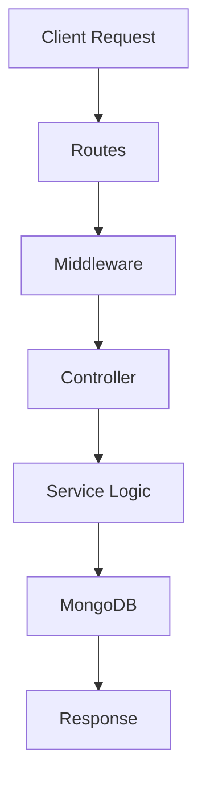

# 🛒 IndoBuy E-Commerce Backend

<div align="center">


### 🚀 Powerful E-Commerce Backend API Built with MERN Stack

> Secure • Scalable • Clean Architecture • Production Ready

</div>

---

# 📌 Overview

**IndoBuy Backend** is a complete REST API backend for a modern e-commerce platform.

This backend handles:

- 🔐 Authentication & Authorization
- 🛍️ Product Management
- ❤️ Wishlist System
- 🛒 Cart Management
- 📦 Order Processing
- 💳 Razorpay Payment Integration
- ☁️ Cloudinary Image Upload
- 👨‍💻 Admin Dashboard APIs
- ⭐ Review & Rating System
- 📊 Sales & Analytics APIs

---

# ⚡ Tech Stack

| Technology    | Purpose               |
| ------------- | --------------------- |
| Node.js       | Backend Runtime       |
| Express.js    | Server Framework      |
| MongoDB       | Database              |
| Mongoose      | ODM                   |
| JWT           | Authentication        |
| bcryptjs      | Password Hashing      |
| Cloudinary    | Image Hosting         |
| Multer        | File Upload           |
| Razorpay      | Payment Gateway       |
| dotenv        | Environment Variables |
| Cors          | Cross-Origin Requests |
| Cookie-parser | Cookie Handling       |
| Nodemon       | Development Server    |

---

# 📂 Project Structure

```bash
IndoBuy-Backend/
│
├── src/
│   ├── config/
│   ├── controllers/
│   ├── database/
│   ├── middlewares/
│   ├── models/
│   ├── routes/
│   ├── services/
│   ├── utils/
│   ├── validations/
│   └── app.js
│
├── public/
├── uploads/
├── .env
├── package.json
└── server.js
```

---

# 🔥 Features

## 👤 User Features

- Register & Login
- JWT Authentication
- Update Profile
- Add to Cart
- Remove from Cart
- Wishlist Products
- Place Orders
- Payment Integration
- View Order History
- Product Reviews

---

## 🛠️ Admin Features

- Add Products
- Update Products
- Delete Products
- Manage Orders
- Manage Users
- Upload Product Images
- Track Sales
- Dashboard Analytics

---

# 🧠 Backend Flow



---

# 🚀 Installation & Setup

## 1️⃣ Clone Repository

```bash
git clone https://github.com/yourusername/indobuy-backend.git
```

---

## 2️⃣ Move into Project

```bash
cd indobuy-backend
```

---

## 3️⃣ Install Dependencies

```bash
npm install
```

---

## 4️⃣ Create .env File

```env
PORT=5000
MONGO_URI=your_mongodb_connection
JWT_SECRET=your_jwt_secret
NODE_ENV=development

CLOUDINARY_CLOUD_NAME=your_cloud_name
CLOUDINARY_API_KEY=your_api_key
CLOUDINARY_API_SECRET=your_api_secret

RAZORPAY_KEY_ID=your_key
RAZORPAY_SECRET=your_secret
```

---

## 5️⃣ Start Development Server

```bash
npm run dev
```

---

# 🌐 API Base URL

```bash
http://localhost:5000/api/v1
```

---

# 🔐 Authentication APIs

## 📍 Register User

### Route

```http
POST /api/v1/auth/register
```

### Request Body

```json
{
  "name": "Saurabh",
  "email": "saurabh@gmail.com",
  "password": "123456"
}
```

### Function Explanation

```js
registerUserController();
```

This function:

- Validates user input
- Checks existing email
- Hashes password using bcrypt
- Creates new user
- Generates JWT token
- Sends response to client

---

## 📍 Login User

### Route

```http
POST /api/v1/auth/login
```

### Request Body

```json
{
  "email": "saurabh@gmail.com",
  "password": "123456"
}
```

### Function Explanation

```js
loginUserController();
```

This function:

- Finds user by email
- Compares password
- Creates JWT token
- Stores token in cookies
- Sends login response

---

## 📍 Logout User

### Route

```http
POST /api/v1/auth/logout
```

### Function Explanation

```js
logoutUserController();
```

This function clears cookies and logs out the user securely.

---

# 🛍️ Product APIs

## 📍 Create Product

### Route

```http
POST /api/v1/product/create
```

### Function Explanation

```js
createProductController();
```

This function:

- Receives product data
- Uploads image to Cloudinary
- Saves product into MongoDB
- Returns created product

---

## 📍 Get All Products

### Route

```http
GET /api/v1/product/all
```

### Function Explanation

```js
getAllProductsController();
```

This function:

- Fetches all products
- Supports pagination
- Supports filtering
- Supports searching
- Returns optimized response

---

## 📍 Get Single Product

### Route

```http
GET /api/v1/product/:id
```

### Function Explanation

```js
getSingleProductController();
```

This function fetches a single product using product ID.

---

## 📍 Update Product

### Route

```http
PUT /api/v1/product/update/:id
```

### Function Explanation

```js
updateProductController();
```

This function:

- Finds product
- Updates product fields
- Updates image if needed
- Saves updated product

---

## 📍 Delete Product

### Route

```http
DELETE /api/v1/product/delete/:id
```

### Function Explanation

```js
deleteProductController();
```

This function deletes product data and image resources.

---

# 🛒 Cart APIs

## 📍 Add to Cart

```http
POST /api/v1/cart/add
```

### Function Explanation

```js
addToCartController();
```

This function:

- Finds user cart
- Adds product
- Updates quantity
- Calculates totals

---

## 📍 Remove from Cart

```http
DELETE /api/v1/cart/remove/:id
```

### Function Explanation

```js
removeFromCartController();
```

This function removes product from user cart.

---

# ❤️ Wishlist APIs

## 📍 Add to Wishlist

```http
POST /api/v1/wishlist/add
```

### Function Explanation

```js
addWishlistController();
```

This function stores favorite products for users.

---

# 📦 Order APIs

## 📍 Create Order

```http
POST /api/v1/order/create
```

### Function Explanation

```js
createOrderController();
```

This function:

- Creates order
- Saves shipping info
- Calculates pricing
- Stores ordered items

---

## 📍 Get User Orders

```http
GET /api/v1/order/my-orders
```

### Function Explanation

```js
getUserOrdersController();
```

This function fetches all orders of logged-in user.

---

# 💳 Razorpay Integration

## 📍 Create Payment Order

```http
POST /api/v1/payment/create-order
```

### Function Explanation

```js
createRazorpayOrderController();
```

This function:

- Creates Razorpay order
- Generates payment amount
- Sends order ID to frontend

---

## 📍 Verify Payment

```http
POST /api/v1/payment/verify
```

### Function Explanation

```js
verifyPaymentController();
```

This function:

- Verifies Razorpay signature
- Confirms payment success
- Updates order status

---

# ☁️ Cloudinary Integration

## 📍 Upload Product Image

### Function Explanation

```js
uploadOnCloudinary();
```

This utility function:

- Receives image file
- Uploads image to Cloudinary
- Returns secure image URL
- Deletes local temp file

---

# 🔒 Middleware Explanation

## 📍 authMiddleware

```js
authMiddleware();
```

### Purpose

- Verifies JWT token
- Protects private routes
- Adds user info to request object

---

## 📍 adminMiddleware

```js
adminMiddleware();
```

### Purpose

- Checks admin role
- Restricts unauthorized access

---

# 🧩 Utility Functions

## 📍 generateToken()

```js
generateToken();
```

### Purpose

- Creates JWT token
- Adds expiry time
- Secures authentication system

---

## 📍 asyncHandler()

```js
asyncHandler();
```

### Purpose

- Handles async errors automatically
- Avoids repetitive try/catch blocks

---

# 📜 Example MongoDB Schema

## 👤 User Schema

```js
const userSchema = new mongoose.Schema({
  name: String,
  email: String,
  password: String,
  role: {
    type: String,
    default: "user",
  },
});
```

---

## 🛍️ Product Schema

```js
const productSchema = new mongoose.Schema({
  title: String,
  description: String,
  price: Number,
  stock: Number,
  category: String,
  images: [],
});
```

---

# 📡 Response Format

## ✅ Success Response

```json
{
  "success": true,
  "message": "Product Created Successfully",
  "data": {}
}
```

---

## ❌ Error Response

```json
{
  "success": false,
  "message": "Something Went Wrong"
}
```

---

# 🧪 Testing APIs

You can test APIs using:

- Postman
- Thunder Client
- Insomnia

---

# 📈 Future Improvements

- 🔔 Real-time Notifications
- 🤖 AI Product Recommendations
- 🌍 Multi Vendor System
- 📱 Mobile App APIs
- 🧾 Invoice Generator
- 📊 Advanced Analytics
- 💬 Chat Support System

---

# 🚀 Deployment

## Deploy Backend on:

- Render
- Railway
- VPS
- AWS EC2
- DigitalOcean

---

# 🛡️ Security Features

- Password Hashing
- JWT Authentication
- Protected Routes
- Role-Based Access
- Environment Variables
- Secure Cookies
- Input Validation
- CORS Protection

---

# 🤝 Contributing

```bash
Fork the repository
Create new branch
Commit changes
Push branch
Create Pull Request
```

---

# 📞 Contact

## 👨‍💻 Developer

### Saurabh Singh

- MERN Stack Developer
- Backend Developer
- GenAI Enthusiast

---

# ⭐ Support

If you like this project:

- 🌟 Star this repository
- 🍴 Fork the repository
- 🧠 Share with developers

---

# 📜 License

This project is licensed under the MIT License.

---

<div align="center">

# ❤️ Thank You For Visiting IndoBuy Backend

### 🚀 Happy Coding Bro!

</div>
